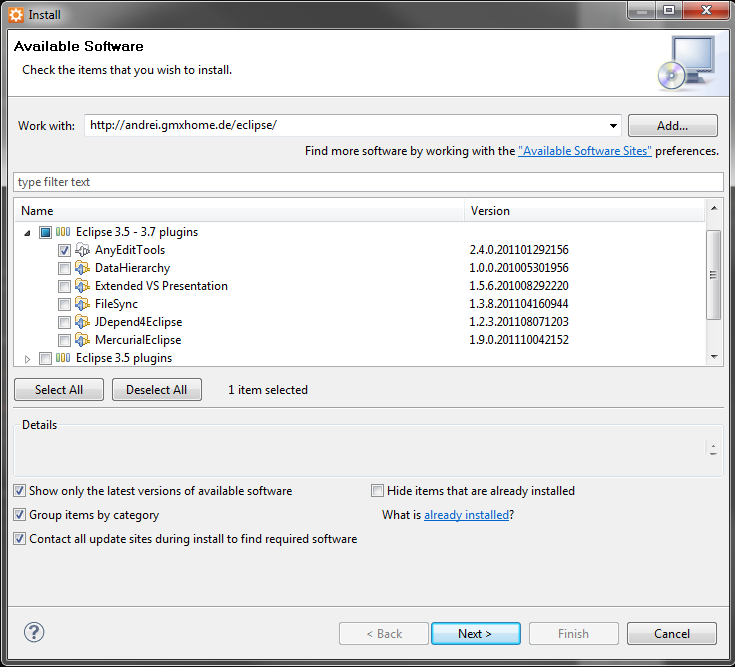
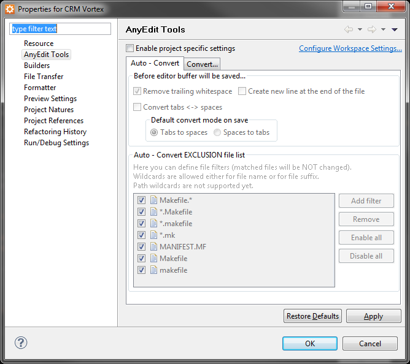

  
So recently I had a coworker get slightly annoyed with me and my trailing whitespaces at the end of lines. I’m using [Aptana](http://www.aptana.com/) and not anything crazy like vim to do my programming work, I don’t actually see the whitespace I’m leaving around.

However, they do show up in the git commits.

Because I don’t want to turn on those annoying characters that show my line breaks and whitespace I tried to find an automated solution. My first thought was that maybe Aptana would have an option to remove all of the whitespace before I save. Alas, no option exists (at least with Aptana 3).

Then I found an Eclipse plugin called AnyEdit that solved my problem. [AnyEdit](http://andrei.gmxhome.de/anyedit/) can be found at (http://andrei.gmxhome.de/anyedit/) .

## Installing AnyEdit

So the first thing you’ll want to do is to load up Aptana, go to Help -> Install New Software. You’ll want to use http://andrei.gmxhome.de/eclipse/ as the “Work With:” URL.

Explore the drop downs and check the AnyEditTools plugin and then hit next. Go through the license agreement pages and Aptana will install the plugin. You’ll be prompted to restart Aptana, which I always recommend.

The best part, is that the strip whitespace feature is turned on by default across all of your projects. In the case where you don’t want to have that functionality, you can go to the properties of a project, and go to the AnyEdit Tools section and turn on Enable Project Specific Settings and then Remove Trailing Whitespace.

And .. it’s that easy. Enjoy having cleaner code and even cleaner git commits.