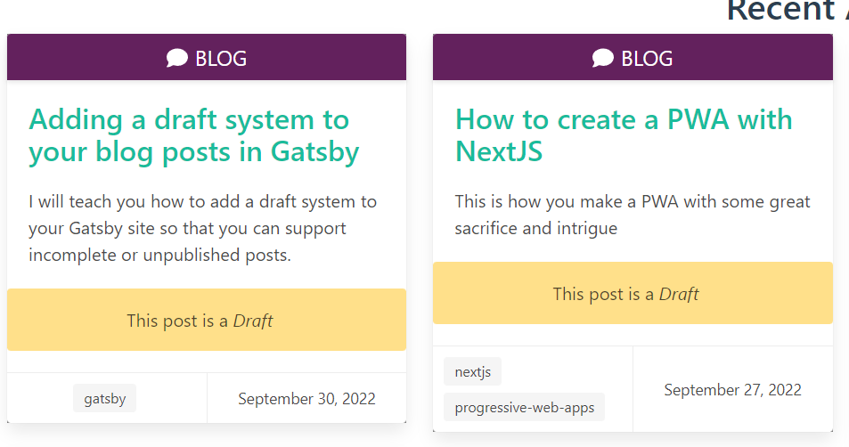

I have thoroughly enjoyed the migration of my blog from WordPress to Gatsby. However, I did realize that one of the features of WordPress that I missed was the ability to save my blog posts as a draft.

I write blog posts by writing a little bit, doing some more research, and then coming back to it later and adding more details before I publish.

Now there does exist a [draft plugin for Gatsby](https://www.gatsbyjs.com/plugins/gatsby-plugin-draft/) to set up a similar draft system for you; however, I feel that with the power of Gatsby and GraphQL, you can implement your blog publishing system that's to your liking.

I will explain two methodologies:

# I want to mark posts as either Published or Unpublished

This option works great if you're starting your blog and don't have many markdown entries or if you prefer having consistent frontmatter attributes across all your markdown files.

## How do I do this?

In ```gatsby-node.js``` add this to the ```allMarkDownRemark``` field in the ```exports.createPages``` section:

```javascript
filter: { frontmatter: {published: {eq: true} }}
```

This gives a filter to the query used to build the pages on the Gatsby site. We're only asking for posts that have the field ```published``` set to true in it's frontmatter.

In ```gatsby-node.js``` in the ```exports.createSchemaCustomization -> createTypes``` declaration, add this to the ```type Frontmatter``` definition:

```javascript
type Frontmatter {
  ...
  published: Boolean
  ...
}
```

Then in *all of your markdown files* you would add the `published` field:
```
---
title: How to do things with things
date: "2056-09-27T00:52:03.284Z"
published: true
---
```

# I want to assume all posts are published unless I flag them as a draft

This is a great option if you have too many markdown posts you would have to go through to add a ```published: true``` into each frontmatter block. By only adding ```draft: true``` to posts you're working on, you can immediately keep a post away from being published.

We do however need to create two fields in order to get this functionality. The first field is a frontmatter one called ```draft```. You'll be setting this to true in your markdown files to indicate that a post is in draft mode.

The second field is one we're adding to our node fields called ```released``. This flag will indicate if the post is visible and can be statically generated.

## Step 1: Change how pages are created

In ```gatsby-node.js``` and in the ```export.createPages``` method, we are going to change the filter for getting all of our markdown posts to using a field called released:

```javascript
...
{
  allMarkdownRemark(
    sort: { fields: [frontmatter___date], order: ASC }
    filter: { fields: { released: { eq: true }}}
    limit: 1000
  ) {
    ...
  }
}
...
```

## Step 2: Add the new released field

Also in ```gatsby-node.js``` and in the ```exports.onCreateNode``` section, we are going to check the node to see if it can be flagged as released.

```javascript
const forcePublish = process.env.NODE_ENV === 'development';

if (node.internal.type === MD_TYPE) {
  const slug = createFilePath({ node, getNode });
  ...
  let isReleased = false;
  if (forcePublish || node.frontmatter && !node.frontmatter.draft) {
    isReleased = true;
  }

  createNodeField({
    name: `released`,
    node,
    value: isReleased,
  })
  ...
}
```

We are testing the current environment to see if we are in development mode, and if we are we are setting the released flag to true. This is so that you can see all of your posts on your site when in development mode. We are then testing to see if the current node's frontmatter data has the draft flag set to false. If that is false then we know that the post is ready to be released.

## Step 3: Add the defaultFalse directive extension 

In ```gatsby-node.js``` and in the ```exports.onCreateNode``` section add this:

```javascript
exports.createSchemaCustomization = ({ actions }) => {
  const { createFieldExtension, createTypes } = actions

  // Create a @defaultFalse directive
  createFieldExtension({
    name: "defaultFalse",
    extend() {
      return {
        resolve(source, info) {
          if (source[info.fieldName] == null) {
            return false
          }
          return source[info.fieldName]
        },
      }
    },
  })

  ...
```

We are creating a custom extenstion to be used as a directive. This directive allows us to use this on other fields. The source will contain all fields from the ```frontmatter``` (like title, description, date, etc). The ```info.fieldname``` is the name of the field you're applying the directive to: (like published or draft). If that happens to be null, then we force it to be false. If not null, then we return the original value.

### Why are we doing this?

This is so that when we query the system for frontmatters (posts) that do not have draft set to true, then instead of defaulting to null they will default to false instead.

## Step 4: Add the types

In ```gatsby-node.js``` in the ```exports.createSchemaCustomization -> createTypes``` declaration, add this to the definition:

```javascript
exports.createSchemaCustomization = ({ actions }) => {
  ...
  createTypes(`
    type Frontmatter {
      ...
      draft: Boolean @defaultFalse
      ...
    }

    type Fields {
      ...
      released: Boolean @defaultFalse
      ...
    }
  `)
}
```

We're using the directive to ensure that the draft and released fields do not end up as ```null```, but ```false``` if they're undefined

## Step 5: Use released filter on your post list page

On your page for displaying your list of available posts, you'll want to add the filter for the new field for your query:

```javascript
export const pageQuery = graphql`
  query {
    site {
      siteMetadata {
        title
      }
    }
    allMarkdownRemark(
      sort: { fields: [frontmatter___date], order: DESC }
      filter: { fields: { released: {eq: true}}}
    ) {
      nodes {
        excerpt
        fields {
          ...
          released
        }
      }
    }
  }
`
```

This is so that only posts that are flagged as released are visible.

## Step 6: Add field to markdown files

Then in your markdown files you would add the ==draft== field:
```
---
title: How to do things with things
date: "2056-09-27T00:52:03.284Z"
draft: true
---
```

# Additional Feature: Show your posts as drafts

Now that you have this setup for your own system, I like to add a visual indicator to me that flags posts as drafts when I'm working locally:

](./images/adding-drafts-to-blog-posts-gatsby/drafts.png)

## Add drafts field to frontmatter on blog pages

```javascript
export const pageQuery = graphql`
  query {
    ...
    allMarkdownRemark(
      sort: { fields: [frontmatter___date], order: DESC }
      filter: { fields: { released: {eq: true}}}
    ) {
      nodes {
        excerpt
        frontmatter {
          draft
          ...
        }
      }
    }
  }
`
```

## Add indicator to post

```jsx
<div className="card-content">
  <p className="title" itemProp="headline" >
    <span>
      <Link to={post.fields.slug} itemProp="url">
        {post.frontmatter.title}
      </Link>
    </span>
  </p>
  {
    post.frontmatter.draft && 
    <p className="notification is-warning has-text-centered">
      This post is a <em>Draft</em>
    </p>
  }
</div>
```

# Additional Feature: Show upcoming posts

Now that we have the ability to put posts in a draft or in development mode, we can now display a list of the upcoming posts in our websites to encourage viewers to come back or to sign-up to a newsletter, etc.

## Example footer component that shows upcoming posts

```jsx
const FooterComponent = () => {
  const data = useStaticQuery(graphql`
    query {
      upcomingPosts: allMarkdownRemark(
        sort: { fields: [frontmatter___date], order: DESC }
        filter: { frontmatter: { draft: {eq: true}}}
        limit: 4
      ) {
        nodes {
          fields {
            slug
          }
          frontmatter {
            title
          }
        }
      }
    }
  `)

  const upcomingNodes = data.upcomingPosts.nodes;

  const UpcomingPostsComponent = ({ posts }) => {
    const renderPostTitle = postData => {
      return <li key={`upcoming-${postData.fields.slug}`}>{postData.frontmatter.title}</li>
    }

    if (posts.length === 0) {
      return <></>
    }
    
    return (
      <>
        <h3 className="title is-3">Upcoming Posts</h3>
        <div className="upcoming-posts is-flex is-flex-direction-row is-flex-wrap-wrap">
          <ul>{posts.map(post => renderPostTitle(post))}</ul>
        </div>
      </>
    )
  }

  // Render the upcoming posts
  return (
    <footer className="page-footer">
      <div className="pre-footer py-3">
        <section className="container">
          <div className="columns">
          <UpcomingPostsComponent posts={upcomingNodes} />
          </div>
        </section>
      </div>
    </footer>
  );
}

export default Footer
```