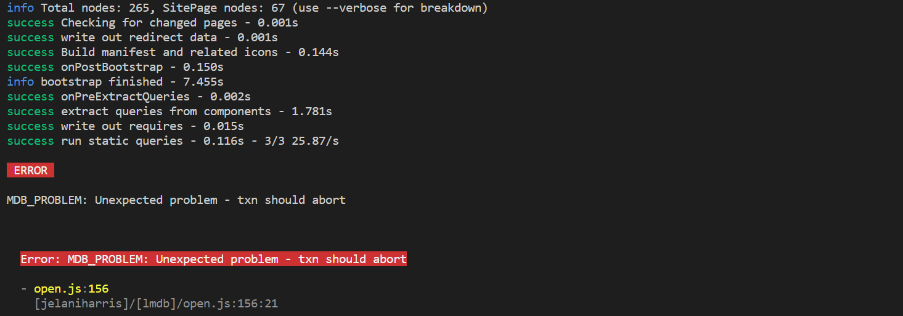

While I was preparing to work locally on my website, I did the typical ```npx gatsby develop``` and was met with this error:

> Error: MDB_PROBLEM: Unexpected problem - txn should abort

](./images/mdbproblem-unexpected-problem-txn-should-abort-in-gatsby/MDB_PROBLEM-txn-should-abort.png)

Eh?

# MDB_PROBLEM? That's a strange error ...

At first I thought I had made a mistake with my markdown files, so I checked all of the ones i changed and couldn't find anything wrong with formatting. I rebooted my development machine, reverted all of my changes and I was still getting this error.

After doing some research I found a couple of ideas that may also work for you if you have this problem. After each solution, try running the ```gatsby develop``` command again to see if it helps.

## Solution 1: Clean out the cache

Try cleaning out the Gatsby Cache, then try running

> npx gatsby clean

## Solution 2: Clear the npm/yarn caches

> npm cache clean --force
> yarn cache clean

## Solution 3: Upgrade Gatsby

I was using Gatsby version 4.13.1, and I upgraded to 4.24.4 and thankfully for me the error disappeared.

> yarn upgrade gatsby@4.24.4

I'm hoping this helps. If you found another solution that works for you, please post it in the comments to help out other people.