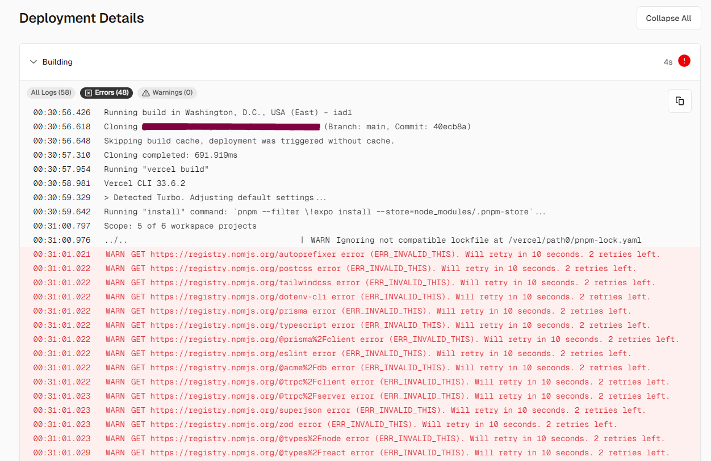

# Fixing ERR_INVALID_THIS error on Vercel using PNPM

I was in the beginning stages of creating my application using [T3 and Clerk](https://github.com/clerk/t3-turbo-and-clerk) when I ran into a peculiar error when attempting to deploy in Vercel.

I was trying to deploy my application in vercel when I was running into this error

](./images/fixing-errinvalidthis-error-on-vercel-using-pnpm/vercel-pnpm-error.png)

To fix this, I needed to run `corepack up` which will put the current version of the packageManager that you're using into your package.json file.

Then in Vercel, be sure to add the environment variable `ENABLE_EXPERIMENTAL_COREPACK` and set it's value to `1`. [This will enable corepack support.](https://vercel.com/changelog/corepack-experimental-is-now-available)

After making this change I was successfully able to get my vercel deployment to work.

I had lost about 3 hours of development time trying to get it to work, so I'm hoping that this small blog post helped you figure this out as well.
