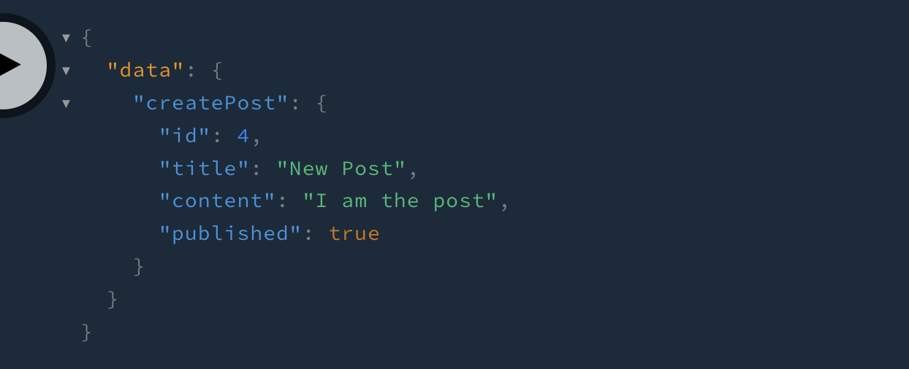

## What is NestJS?

NestJS is a Node.js framework for building efficient, reliable, and scalable server-side applications. It uses modern TypeScript and provides a level of abstraction above common Node.js frameworks (Express.js and Fastify for example). It also exposes their APIs directly to the developer which allows us the freedom to use the myriad of third-party modules which are available for the underlying platform

I highly recommend using something like NestJs if you want a Javascript backend api that is like express but with modern modularity, dynamic injection, enterprise and microservice ready.

## What is GraphQL?

GraphQL is a query language for your api that is designed to provide the data that you request exactly the way you want it and in the format you need it to be in. You describe the shape of your data in a single request and the server responds with that data. This means that data retrieval using GraphQL is efficient.

## What is Prisma?

[Prisma.IO](http://Prisma.IO) is an ORM (Object Relational Mapping) tool that will help you work with databases more easily by providing an easy-to-use way to access your database by using simple commands instead of long SQL queries.

For this example, we’ll be using Sqlite as a database for convenience. But you can use databases like MySql, PostgreSQL and MongoDB.

## Installing NestJs and GraphQL

First we’ll start a new NestJs project

```bash
yarn global add @nestjs/cli
nest new tutorial-nextjs-graphql
yarn start:dev
```

This will create a new project directory using the name tutorial-nextjs-graphql and will add some boilerplate files for starting our application. I chose yarn for my package manager and will be using that from now on.

Then we will install the required packages we need for this project:

```bash
yarn add @nestjs/graphql @nestjs/apollo @apollo/server graphql
```

Nest will expose a GraphQL module that can be configured to use the Apollo GraphQL server in our nest application. The above command adds GraphQL apis support, and apollo server to our project.

Once we have those dependencies installed we can import the GraphQL module into our AppModule file:

```tsx
import { Module } from "@nestjs/common"
import { AppController } from "./app.controller"
import { AppService } from "./app.service"
import { GraphQLModule } from "@nestjs/graphql"
import { ApolloDriver } from "@nestjs/apollo"

@Module({
  imports: [
    GraphQLModule.forRoot({
      driver: ApolloDriver,
    }),
  ],
  controllers: [AppController],
  providers: [AppService],
})
export class AppModule {}
```

NestJs offers two ways of building a graphql api: Code-First and Schema-First

### Code First Schema

With the code first approach, the corresponding GraphQL schema is generated using decorators and TypeScript classes. This method is beneficial for those who wish to work solely with TypeScript and eliminate the need to switch between different language syntaxes.

### Schema First

In the Schema First approach, the primary reference is the SDL (Schema Definition Language) files of GraphQL. SDL is a universal method that allows the sharing of schema files across various platforms, regardless of the language. NestJs automatically produces your TypeScript definitions (utilizing either classes or interfaces) based on the GraphQL schemas, minimizing the necessity for repetitive code.

**We’re going to go Schema First** because a lot of other approaches use the Code First and I would like to show a different method for creating your GraphQL Schema.

### Create a Nest Resource

```bash
npx nest g resource post
```


You’ll see a prompt where you’ll be able to choose which kind of layer you want to use. I picked GraphQL Schema First. Then it’ll ask you “Would you like to generate CRUD entry points?” and say **yes**. Then it’ll generate a bunch of scaffolding files for you.


## Adding GraphQL

The graphql file generated from the crud generation isn’t quite what we need so let’s add it to our file ourselves. Modify the src/post/post.graphql file to look like this:

```graphql
type Post {
  id: Int
  title: String!
  content: String
  published: Boolean!
}

input CreatePostInput {
  title: String!
  content: String
  published: Boolean
}

input UpdatePostInput {
  id: Int!
}

type Query {
  getPosts: [Post]!
  getPost(id: Int!): Post
}

type Mutation {
  createPost(createPostInput: CreatePostInput!): Post!
  updatePost(updatePostInput: UpdatePostInput!): Post!
  removePost(id: Int!): Post
}
```

### Auto-Generate Graphql Types

Now that we have our graphql files in the same folder as our object types we need to modify the GraphQl module to be able to see those files, and to also turn them into usable types by our system.

Modify the module portion of the app.module.ts to be:

```tsx
import { Module } from "@nestjs/common"
import { AppController } from "./app.controller"
import { AppService } from "./app.service"
import { GraphQLModule } from "@nestjs/graphql"
import { ApolloDriver } from "@nestjs/apollo"
import { join } from "path"
import { PostModule } from "./post/post.module"

@Module({
  imports: [
    GraphQLModule.forRoot({
      driver: ApolloDriver,
      typePaths: ["./**/*.graphql"],
      definitions: {
        path: join(process.cwd(), "src/generated/graphql.ts"),
      },
      sortSchema: true,
    }),
    PostModule,
  ],
  controllers: [AppController],
  providers: [AppService],
})
export class AppModule {}
```

I’ll explain what each part is doing:

```tsx
  typePaths: ['./**/*.graphql'],
```

This will let the module scan for any file that ends in graphql to be apart of the schema.

```tsx
  definitions: {
    path: join(process.cwd(), 'src/generated/graphql.ts'),
  },
```

This tells the module to put the generated typescript definitions in the generated folder off of the source folder

```tsx
sortSchema: true,
```

This will sort the generated schema file lexicographically instead of in the order

## Spin up Database using Prisma

First let’s install the dependencies

```bash
yarn add sqlite3 @prisma/client ts-morph
yarn add -D prisma

```

Once that is installed run Prisma to setup the ORM files.

```bash
yarn run prisma init --datasource-provider sqlite
```

This will create a prisma/schema.prisma file. In that file we will add the model for our Post

```tsx
// This is your Prisma schema file,
// learn more about it in the docs: https://pris.ly/d/prisma-schema

generator client {
  provider = "prisma-client-js"
}

datasource db {
  provider = "sqlite"
  url      = env("DATABASE_URL")
}

// Add the post model here
model Post {
  id        Int     @id @default(autoincrement())
  title     String
  content   String?
  published Boolean @default(false)
}

```

After that you want to create the database and the prisma classes by typing in:

```tsx
npx prisma generate
```

### Create Prisma Service

Now we need to create a prisma service. In src/prisma/prisma.service.ts add:

```jsx
import { Injectable, OnModuleInit } from "@nestjs/common"
import { PrismaClient } from "@prisma/client"

@Injectable()
export class PrismaService extends PrismaClient implements OnModuleInit {
  async onModuleInit() {
    await this.$connect()
  }
}
```

We are extending the Prismaclient to provide an abstraction of the prisma client that can integrate with the NestJS architecture. We can then provide this service to other services via dependency injection.

Now go to your /src/post/module.ts and add the PrismaService to the list of providers:

```tsx
import { Module } from "@nestjs/common"
import { PostService } from "./post.service"
import { PostResolver } from "./post.resolver"
import { PrismaService } from "src/prisma/prisma.service"

@Module({
  providers: [PostResolver, PostService, PrismaService],
})
export class PostModule {}
```

### Adding create and update DTO objects

in /src/post/dto/create-post.input.ts add:

```tsx
export class CreatePostInput {
  title: string
  content?: string
  published: boolean
}
```

This will represent the input we’re providing to create a new post.

Then in /src/post/dto/update-post.input.ts add:

```tsx
import { CreatePostInput } from "./create-post.input"
import { PartialType } from "@nestjs/mapped-types"

export class UpdatePostInput extends PartialType(CreatePostInput) {
  id: number
}
```

That will represent the input necessary to update a post. Notice that this is extending the CreatePostInput DTO but it requires an ID.

### Updating Post Resolver

Change the /src/post/post.resolver.ts to be:

```tsx
import { PostService } from "./post.service"
import { Resolver, Mutation, Args, Query } from "@nestjs/graphql"
import { CreatePostInput } from "./dto/create-post.input"
import { UpdatePostInput } from "./dto/update-post.input"
import { Post as DBPost } from "@prisma/client"

@Resolver()
export class PostResolver {
  constructor(private readonly postService: PostService) {}

  @Mutation("createPost")
  createPost(
    @Args("createPostInput") createPostInput: CreatePostInput
  ): Promise<DBPost> {
    return this.postService.create(createPostInput)
  }

  @Mutation("updatePost")
  updatePost(
    @Args("updatePostInput") updatePostInput: UpdatePostInput
  ): Promise<DBPost> {
    return this.postService.update(updatePostInput.id, updatePostInput)
  }

  @Mutation("removePost")
  removePost(@Args("id") id: number) {
    return this.postService.remove(id)
  }

  @Query("getPosts")
  getPosts() {
    return this.postService.findAll()
  }

  @Query("getPost")
  getPost(@Args("id") id: number): Promise<DBPost> {
    return this.postService.findOne(id)
  }
}
```

### Updating Post Service:

Make the /src/post/post.service.ts look like:

```tsx
import { Injectable } from "@nestjs/common"
import { CreatePostInput } from "./dto/create-post.input"
import { UpdatePostInput } from "./dto/update-post.input"
import { PrismaService } from "src/prisma/prisma.service"

@Injectable()
export class PostService {
  constructor(private prisma: PrismaService) {}

  async create(createPostInput: CreatePostInput) {
    return this.prisma.post.create({ data: createPostInput })
  }

  async findAll() {
    return this.prisma.post.findMany({ orderBy: { id: "desc" } })
  }

  async findOne(id: number) {
    return this.prisma.post.findFirst({ where: { id: id } })
  }

  async update(id: number, updatePostInput: UpdatePostInput) {
    return this.prisma.post.update({
      data: updatePostInput,
      where: {
        id: id,
      },
    })
  }

  async remove(id: number) {
    this.prisma.post.delete({ where: { id: id } })
  }
}
```

## Starting NestJs Service

```tsx
yarn start:dev
```

You should get output that resembles:

```tsx
[3:56:28 PM] File change detected. Starting incremental compilation...

[3:56:28 PM] Found 0 errors. Watching for file changes.

[Nest] 2800  - 06/09/2024, 3:56:29 PM     LOG [NestFactory] Starting Nest application...
[Nest] 2800  - 06/09/2024, 3:56:29 PM     LOG [InstanceLoader] AppModule dependencies initialized +14ms
[Nest] 2800  - 06/09/2024, 3:56:29 PM     LOG [InstanceLoader] PostModule dependencies initialized +0ms
[Nest] 2800  - 06/09/2024, 3:56:29 PM     LOG [InstanceLoader] GraphQLSchemaBuilderModule dependencies initialized +0ms
[Nest] 2800  - 06/09/2024, 3:56:29 PM     LOG [InstanceLoader] GraphQLModule dependencies initialized +0ms
[Nest] 2800  - 06/09/2024, 3:56:29 PM     LOG [RoutesResolver] AppController {/}: +2ms
[Nest] 2800  - 06/09/2024, 3:56:29 PM     LOG [RouterExplorer] Mapped {/, GET} route +2ms
[Nest] 2800  - 06/09/2024, 3:56:29 PM     LOG [GraphQLModule] Mapped {/graphql, POST} route +187ms
[Nest] 2800  - 06/09/2024, 3:56:29 PM     LOG [NestApplication] Nest application successfully started +2ms
```

Now you have your api up and running! Now let’s try to make a query against it.

## How to use GraphQL Playground

First in your web-browser go to the url [`http://localhost:3000/graphql`](http://localhost:3000/graphql)

You should see a screen that resembles the GraphQL Playground:


### Our first create, or mutation

On the left hand side, is where we will put in our query to make a new post:

```tsx

mutation {
  createPost(createPostInput:{
    title:"New Post",
    content:"I am the post",
    published: true
  }) {
    id, title, content, published
  }
}
```

That graphql will create a new post. If you hit the large play button between the two halves of the window, you’ll see that it made a post on the other side:



### How do I get that data back?

Now let’s try to get that data back from our post. Use this query to get the id back that you just created.

```tsx
query($id: Int!) {
  getPost(id: $id) {
    id, title, content, published
  }
}
```

Towards the bottom of the GraphQL Playground is where you’ll see a section called “Query Variables”. You’ll want to expand that and add this JSON:

```tsx
{"id": 4}
```

(Of course, use the same id number you got when you created your data above)

If you run it, you should get the data you entered in before!


## That’s it

So now you know how to create a NestJS API using GraphQL with help from Prisma for accessing the database.

If you want to see the source code for this example project you can look at it at [https://github.com/jelaniharris/nestjs-graphql-example](https://github.com/jelaniharris/nestjs-graphql-example)
