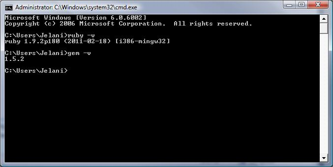

So last week I got a little tired of having to reboot my computer to dual-boot in a linux environment so that I could work on Rails stuff. Then I decided to try using Rails in Windows. Here’s a step by step guide on how to install rails in Windows.

## Install Ruby 1.9

To install ruby on our windows machine we will be using RubyInstaller. RubyInstaller is the easiest way to install ruby in windows. It includes the Ruby execution environment and documentation.

First download and install The [RubyInstaller](http://rubyinstaller.org/download.html).  Installing it to _C:\\Ruby192_ is perfectly fine. I would **not** recommend installing Ruby to a place that has spaces in it, like the Program Files folder.

From here you can also download the DevKit as well. It allows you to have RubyGems build C-based gems. If you decide to get the DevKit, just install it to the _C:\\Ruby192\\devkit_ folder for now.

So as you’re installing the RubyInstaller, Be sure to select, “Add Ruby Executables to your Path”

Now let’s verify that Ruby has been correctly installed. Get to your command prompt (Via Start -> Run -> type in _cmd_). Then type in:

> ruby -v

Then it should reply with something similar to:

> ruby 1.9.2p180 (2011-02-18) \[i386-mingw32\]

Now with your command prompt still open, let’s check to see that RubyGems was installed as well:

> gem -v

Hey that wasn’t so difficult was it? I told you that RubyInstaller was easy 🙂

## Install SqlLite3

So when running rails we would like to have a database to start off with without having to set up a local database connection. And of course, Windows does not support SqlLite right out of the box. Thus we will have to get it ourselves.

Go to the [SQLite download page](http://sqlite.org/download.html "SqlLite Download Page") and find the precompiled binaries for windows section and download the [sqlite-dll-win32-x86-3070603.zip](http://www.sqlite.org/sqlite-dll-win32-x86-3070603.zip "Sqlite for windows")

After unzipping that file, you should end up with the files sqlite3.dll and sqlite3.def. Copy both of those files into the _C:\\Ruby192\\bin_ directory.

Also, while you’re still at the SqlLite download page you should pick up the shell file ([sqlite-shell-win32-x86-3070603.zip](http://www.sqlite.org/sqlite-shell-win32-x86-3070603.zip "SQLite shell file")) as well. The command line shell is useful for looking around in your sqlite3 databases. Copy the executable in the zip also to the _C:\\Ruby192\\bin_ directory. You can verify that this is installed by typing:

> sqllite3 -version

Now we should install the ruby bindings to SQLite3

> gem install sqlite3

## Install Rails 3

Rails is distributed by RubyGems. When you install Ruby, the RubyGems system is also installed. This makes it really easy to install Rails.

Install Rails by typing:

> gem install rails

This should take a few minutes because it is installing several of the Rails dependencies (ActiveRecord, ActionPack, ActiveSupport, etc).

When that is done installing, verify that the correct version of Rails was installed by typing

> rails -v

And it should respond with 3.0.7 or higher

## Creating a Rails application

Go into your development directory and type in:

> rails new project\_name

Replace the project\_name with the name of your new application. You should see it create a bunch of new directories and files

Now we need to install the gems we are going to use with this project. You can install the gems using:

> bundle install

Once those gems are installed, we need to create the sqlite3 database in your project directory by typing in:

> rake db:migrate

Once that is done, start your rails server by using the commands

> rails server

And then navigate to [http://localhost:3000/](http://localhost:3000/) to view your application. It should look something similar to this:

Now get out there and start working on your web projects!